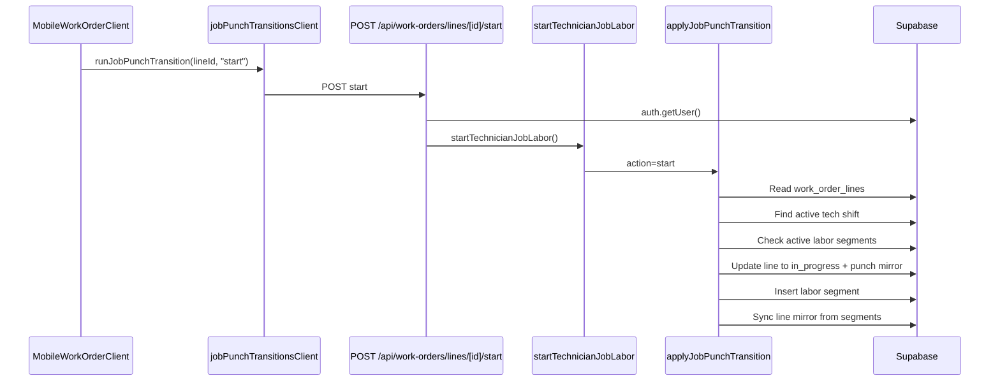

# ProFixIQ Daily Operations System Audit

Status: In progress

Master tracker: #992

## Scope

This audit prioritizes the production workflow used by repair shops each day:

1. Intake and booking
2. Work-order creation
3. Work-order line creation and assignment
4. Technician mobile and labor punches
5. Inspections and evidence
6. Parts request, sourcing, receiving, issuing, and returns
7. Quotes and customer approval
8. Repair completion and parent status synchronization
9. Invoice creation, delivery, and payment
10. Customer portal access and visibility

## Audit rules

- Static scanner results are investigation leads, not confirmed defects.
- Confirmed defects require direct source evidence.
- Every finding records affected files, operational impact, repair direction, and regression tests.
- Security findings distinguish tenant isolation from ordinary workflow consistency.

## Current flow map

## Trace 1: Technician starts a job

### Files hit

- `features/work-orders/mobile/MobileWorkOrderClient.tsx`
- `features/work-orders/lib/jobPunchTransitionsClient.ts`
- `app/api/work-orders/lines/[id]/start/route.ts`
- `features/work-orders/server/technicianJobLabor.ts`
- `features/work-orders/server/applyJobPunchTransition.ts`
- `features/work-orders/server/laborSegments.ts`
- `features/work-orders/server/logOperationalEvent.ts`
- Tables: `work_order_lines`, `work_order_line_labor_segments`, `tech_shifts`, `activity_logs`

## Confirmed findings

### PFIQ-OPS-001 — Job punch transitions are not atomic

The start path updates the work-order line before inserting the canonical labor segment. If the segment insert or subsequent mirror sync fails, the endpoint returns an error after the line has already been changed. Pause and finish also perform several dependent writes without a transaction.

Impact:

- Line can display `in_progress` without an active labor segment.
- Punch mirror timestamps can disagree with labor segments.
- Finish can close labor before the line completion update succeeds.
- Mobile receives an error even though part of the operation committed.

Required repair:

Move each transition into a shop-scoped Postgres RPC/transaction that validates and writes the line, segments, inspection finalization, and event record atomically.

### PFIQ-OPS-002 — Shift fallback can accept another shop's shift

The start/resume transition first searches for a shift scoped to the line's shop, but then falls back to any active or legacy open shift for the technician without filtering by shop.

Impact:

A stale or concurrent shift from another shop can satisfy the clock-in requirement for work performed on the current line.

Required repair:

Remove the unscoped fallback. Require `tech_shifts.shop_id = work_order_lines.shop_id`, and return an integrity error if legacy rows lack a shop.

### PFIQ-OPS-003 — Technician assignment dual-write can drift

`assign-line` updates `work_order_lines.assigned_tech_id`, then separately upserts `work_order_line_technicians`. Failure of the second write is explicitly ignored.

Impact:

Desktop/mobile views using `assigned_tech_id` can disagree with features using the many-to-many assignment table.

Required repair:

Use one canonical assignment model or move both writes into a single transactional RPC. Do not return success when the relationship write fails.

## Next traces

- Pause, resume, finish, and parent status roll-up
- Inspection completion to repair-line update
- Parts request through receiving and issue
- Quote send and portal approval decision
- Ready-to-invoice and invoice generation
- Mobile versus desktop state consistency
