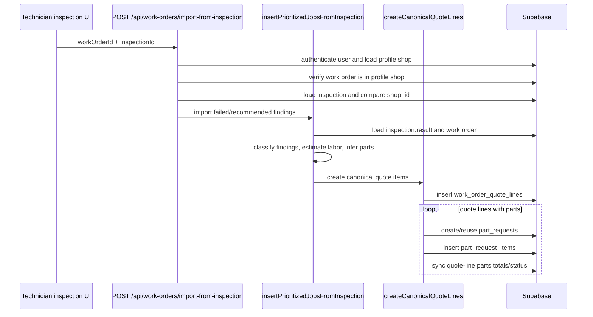

# Inspection to Quote Flow Audit

Parent tracker: #992

## Flow

## Primary files

- `app/api/work-orders/import-from-inspection/route.ts`
- `features/work-orders/lib/work-orders/insertPrioritizedJobsFromInspection.ts`
- `features/work-orders/lib/work-orders/canonicalQuoteLines.ts`
- `features/parts/server/syncQuoteLinePartsStatus.ts`

## Primary tables

- `inspections`
- `work_orders`
- `work_order_quote_lines`
- `part_requests`
- `part_request_items`

## Confirmed findings

- The quote/parts creation pipeline is not transactional; later failure leaves earlier inserts committed.
- Eligibility logic imports keyword-classified diagnosis/maintenance findings even when the inspection item is not failed or recommended.
- The import route checks same-shop ownership but does not prove the supplied inspection belongs to the supplied work order/vehicle.
