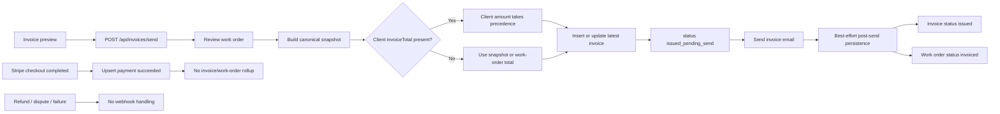

# Invoice finalization, resend, and reversal flow

## Current traced flow

## Confirmed defects

- #1013 Client-provided invoice total can override the canonical server snapshot.
- #1014 Resending updates the latest invoice row in place rather than preserving an immutable issued version.
- #1015 Refunds, failures, and disputes are not reconciled after a payment is marked succeeded.
- #1010 Successful Stripe payments are not rolled into invoice balance or work-order closure.
- #1011 Portal checkout uses original invoice total instead of outstanding balance.
- #1012 Staff checkout accepts client-provided amount and work-order linkage.

## Target invariant

One immutable invoice version must define the collectible amount. Every payment event must post to an append-only ledger and atomically recalculate net paid amount, remaining balance, invoice state, and work-order state. Delivery events must not rewrite financial history.
