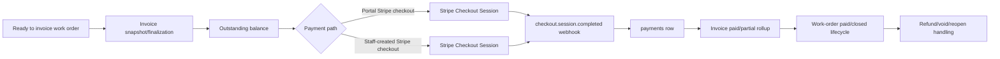

# Invoice payment and closure flow

Parent audit: #992

## Canonical flow under review

## Confirmed defects

- #1010 — Stripe payment success is persisted to `payments` but is not rolled into invoice balance/status or work-order closure.
- #1011 — Portal checkout uses the full invoice total rather than the outstanding balance after prior payments.
- #1012 — Staff checkout trusts client-supplied amount/currency/work-order metadata instead of deriving and validating canonical invoice data server-side.

## Verified source boundaries

### Portal checkout

`app/api/portal/payments/checkout/route.ts` verifies portal customer ownership of the work order and shop Stripe readiness, then reads the latest invoice total and sends that entire total to Stripe. It does not subtract prior succeeded payments or reject an already-paid invoice.

### Staff checkout

`app/api/stripe/payments/checkout/route.ts` authenticates a same-shop staff role, but accepts `amountCents`, `currency`, `description`, and optional `workOrderId` directly from the request. It does not load or validate the work order/invoice or derive the collectible balance.

### Webhook

`features/stripe/api/stripe/webhook/route.ts` verifies the Stripe signature and upserts a succeeded `payments` row by `stripe_session_id`. The payment handler does not update invoice balance/status or work-order lifecycle.

## Required target architecture

One canonical payment-posting transaction should:

1. Resolve and lock the invoice and work order.
2. Idempotently insert/update the payment by provider transaction identity.
3. Recalculate total succeeded payments and refunds.
4. Derive outstanding balance and payment state.
5. Update invoice paid/partial/refunded/void state.
6. Advance or reopen the work order according to documented closure rules.
7. Return the canonical payment, invoice, and work-order state.

Checkout creation should use this same canonical balance model and never trust a client-supplied full amount without an authorized, audited partial-payment override.
