# Parts lifecycle audit

Parent tracker: #992

## Operational flow

```mermaid
flowchart LR
    A[Inspection finding or repair request] --> B[part_requests]
    B --> C[part_request_items]
    C --> D[Inventory part selected]
    D --> E[Parts package committed]
    E --> F[work_order_parts snapshot]
    F --> G[Allocation]
    G --> H[stock_moves]
    H --> I[Purchase order / receiving]
    I --> J[Issue or consume]
    J --> K[Invoice parts snapshot]
```

## Canonical records observed

- `part_requests`
- `part_request_items`
- `work_order_parts`
- `work_order_part_allocations`
- `stock_moves`
- `purchase_orders`
- `work_order_quote_lines`
- `work_order_lines`

## Request-level package commit

Entry point:

- `app/api/parts/requests/[requestId]/commit-package/route.ts`

The route validates the parent request and loops through each request item. Each item independently calls `parts_ensure_work_order_part`. Existing rows are treated as `already_committed`; invalid items are skipped; RPC failures are captured per item.

Because items commit independently, the request can return an overall failure after some `work_order_parts` rows have already been created. Tracked in #1002.

## Item edit plus allocation

Entry point:

- `app/api/parts/requests/items/[itemId]/add/route.ts`

The route first updates the staging `part_request_items` row. When `createAllocation` and `locationId` are supplied, it then calls `upsert_part_allocation_from_request_item` with stock movement enabled.

An allocation failure does not roll back the staging edit. Mismatch acknowledgement is written afterward and errors are ignored. Tracked in #1003.

## Receipt path

Entry points reviewed:

- `app/api/parts/requests/items/[itemId]/receive/route.ts`
- `app/api/parts/_lib/receivePartRequestItem.ts`

Receipt itself is delegated to `receive_part_request_item`, which is the correct transaction boundary for inventory receipt. After receipt, the application separately calls `syncQuoteLinePartsStatus` when the request item is linked to a quote line. This derived synchronization remains under continued audit.

## Confirmed parts findings

- #999 — inspection-to-quote and parts creation is not atomic.
- #1002 — request-level parts package commit is not atomic.
- #1003 — request-item edits can commit before allocation/stock movement fails.

## Next trace

- PO creation and request-item linkage
- partial receiving and over-receipt controls
- allocation versus physical stock availability
- issue/consume transaction boundaries
- return and reversal ledger behavior
- invoice snapshot treatment of staged, allocated, received, and consumed parts
