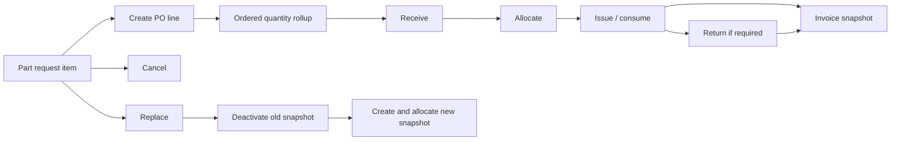

# Parts ordering, cancellation, replacement, and invoice flow audit

Parent audit: #992

## Scope

This trace covers the operational path from a staged request item into purchase-order lines, partial ordering, cancellation, replacement, allocation release, and invoice snapshot generation.

## Canonical path

## Confirmed findings

### #1007 — Replacement can reuse an old active snapshot

`parts_replace_request_item` only deactivates the old `work_order_parts` row when no quantity has been consumed. If the old row remains active, the subsequent allocation path can reuse that row after the request item has already been changed to a new part. Cancellation/replacement lookups also do not consistently require `is_active = true`.

### #1008 — Invoice can prefer the unissued allocation remainder

Invoice assembly loads allocation rows first and suppresses canonical work-order-part rows whenever an allocation remains for the line. After partial issue, the allocation is the unissued remainder while `work_order_parts` contains consumed and returned quantities. Allocation pricing also uses `unit_cost` rather than the canonical sell snapshot.

### #1009 — Partial PO quantity is marked fully ordered

The PO-line RPC sets the request item to `ordered` regardless of whether total ordered quantity is below the requested quantity. The linked work-order-part lifecycle can show `partially_ordered`, creating a status mismatch.

## Verified protections

- PO line creation is tenant checked against the request item shop.
- PO-line inserts have an idempotency key and a uniqueness boundary.
- Allocation release is performed through a transactional RPC.
- Canonical issue and return enforce quantity limits and idempotency.

## Remediation order

1. Fix replacement active-row selection and consumed-part replacement policy.
2. Make invoice quantity and price derive from canonical net-use records.
3. Align request-item partial-order status and over-order policy.
4. Add cross-flow integration tests from request through invoice.
