# Parts Receiving, Issue, and Return Audit

Parent audit: GitHub issue #992

## Canonical flow

```mermaid
flowchart LR
    A[Purchase order or request item] --> B[Receive request item]
    B --> C[Positive stock move]
    C --> D[Request and work-order-part received quantities]
    D --> E[Allocate stock]
    E --> F[Issue work-order part]
    F --> G[Negative stock move]
    G --> H[Consumed quantities]
    H --> I[Return to stock]
    I --> J[Positive return stock move]
    J --> K[Returned quantities and lifecycle reconciliation]
```

## Main implementation boundaries

- `app/api/parts/_lib/receivePartRequestItem.ts`
- `app/api/parts/work-order-parts/[partId]/issue/route.ts`
- `app/api/parts/consume/route.ts`
- `features/work-orders/lib/parts/consumePart.ts`
- `db/sql/2026-07-11_parts_lifecycle_completion.sql`

## Confirmed findings

### #1004 — Receiving does not require a stable idempotency key

The receive RPC generates a timestamp-based fallback key when the caller omits one. Every retry therefore has a different key and can create another receipt.

### #1005 — Legacy consume bypasses the canonical transactional issue command

The legacy consume path creates a stock move first and inserts its work-order allocation afterward. Allocation failure leaves inventory deducted, and retrying has no stable idempotency protection.

### #1006 — Return does not reconcile the linked request-item consumption state

Canonical issue updates both `work_order_parts` and `part_request_items`. Return updates stock and `work_order_parts.quantity_returned`, but leaves the linked request item marked consumed.

## Verified protections in the canonical SQL path

- Receipt quantity is checked against a linked PO line when supplied.
- Receipt quantity is checked against the requested/ordered limit when no PO line is supplied.
- Issue requires sufficient allocation and physical on-hand quantity.
- Return prevents returning more than the issued and not-yet-returned quantity.
- Issue and return require explicit idempotency keys.

## Remaining trace

- Purchase-order creation and line linkage
- PO cancellation and replacement
- Allocation release semantics
- Invoice snapshot treatment of issued versus returned parts
- RLS and role capability checks for every canonical command
