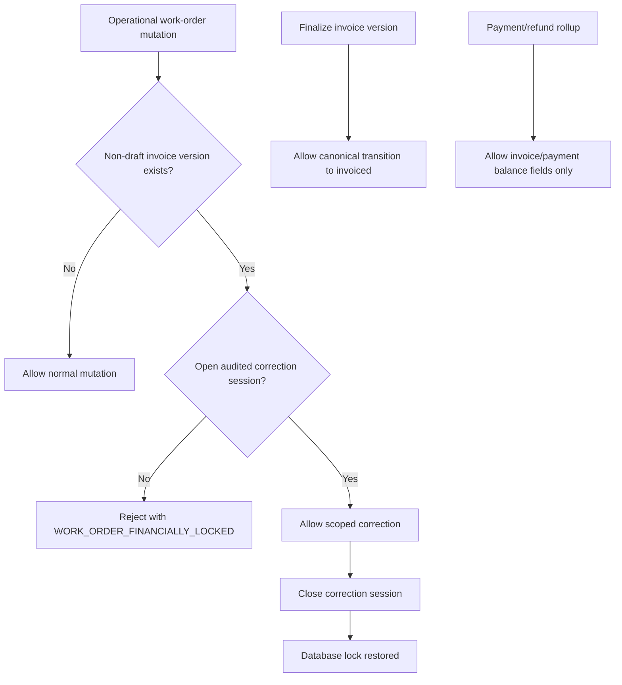

# Phase 2 — Financial Lifecycle Protection Flow

## Boundary

The protection is enforced by PostgreSQL triggers, not by UI-only checks. This keeps direct Supabase writes, API routes, service-role clients, background jobs, and RPCs under the same policy.

## Audited exception

Owner, admin, or manager users may open one correction session per work order with:

- Stable operation key
- Required reason
- Explicit scope
- Actor identity
- Open and close timestamps
- Financial outbox events

The immutable invoice version is never edited by the correction session.
